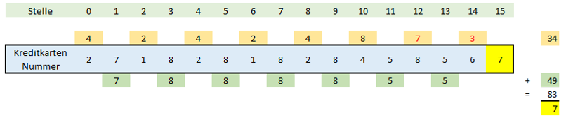
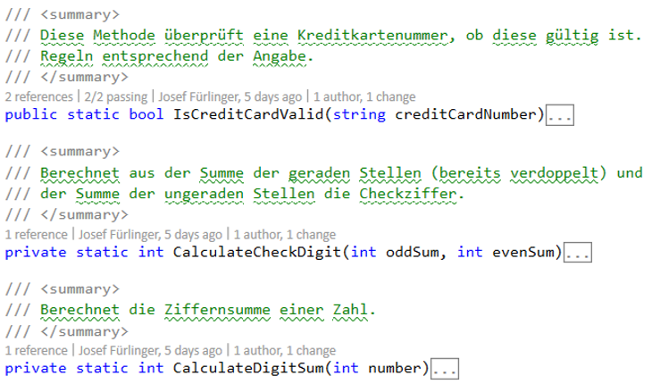
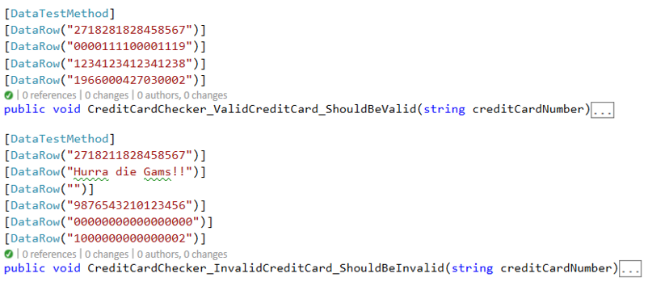

# CreditCard Checker

## Lehrziele

* Algorithmen
* Testfälle

## Anforderung

Implementieren Sie einen Kreditkarten-Prüfer. Das heißt, Ihre Prüfroutine erhält als Parameter eine 16-stellige Kreditkarten Nummer als Zeichenkette, welche per nachfolgendem Algorithmus überprüft werden soll.

Die Kreditkartennummer (16 Stellen!) ist durch eine Prüfziffer (15. Stelle, die bei der Berechnung nicht mitverwendet wird) wie folgt gegen Fehleingaben abgesichert:

1. Die Ziffern an den Stellen mit gerader Nummer (beginnend bei 0) werden verdoppelt und `deren Ziffernsumme` wird aufsummiert!
2. Die Ziffern an den Stellen mit ungerader Nummer werden aufsummiert!
3. Die beiden erhaltenen Zahlen werden addiert und die Differenz zur nächsten Zehnerzahl wird ermittelt, die gleich groß oder größer ist als die Summe der geraden bzw. ungeraden Stellen. Diese Differenz zur nächsten Zehnerzahl (0-9) ist dann die Prüfziffer (15. Stelle der Kreditkartennummer).
4. Ist die Kreditkartennummer gültig, liefert die Prüfroutine true, ansonsten `false`.

### Hinweis

Die Umwandlung von Ziffen (Datentyp: `char`) hin zu Zahlen (Datentyp: `int`) darf nicht mit Framework-Hilfsmethoden durchgeführt werden (z.B. `Convert.ToInt32(..)`).

## Logik

Die Hauptmethode im CreditCardChecker stellt die Methode `IsCreditCardValid(..)` dar. Die anderen
Methoden sind Hilfsmethoden, welche in der Hauptmethode aufgerufen werden (müssen).

## Testfälle

Es sind bereits Testfälle implementiert, welche Sie zum Testen Ihrer Umsetzung verwenden können:

